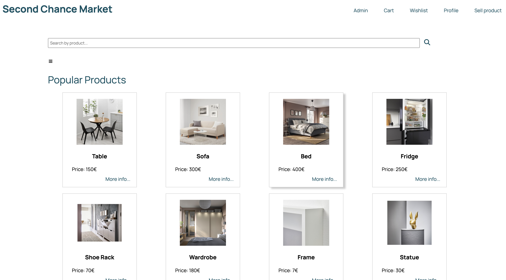

# Second Chance Market

## Group ltw03g01

- José Lopes (up202208288) 33%
- Mariana Pereira (up202207545) 33%
- Mário Araújo (up202208374) 33%

## Install Instructions

    git clone git@github.com:FEUP-LTW-2024/ltw-project-2024-ltw03g01.git
    git checkout final-delivery-v1
    sqlite3 -init Database/db.sql Database/db.db
    php -S localhost:9000

## External Libraries

We have used the following external libraries:

- Font awesome

## External API

We also have used the following external API's:

- Google Maps API
- LocationIQ 

## Screenshots

### Main Page

### Product Page

### Profile Page

## Implemented Features

**General**:

- [x] Register a new account.
- [x] Log in and out.
- [x] Edit their profile, including their name, username, password, and email.

**Sellers**  should be able to:

- [x] List new items, providing details such as category, brand, model, size, and condition, along with images.
- [x] Track and manage their listed items.
- [x] Respond to inquiries from buyers regarding their items and add further information if needed.
- [x] Print shipping forms for items that have been sold.

**Buyers**  should be able to:

- [x] Browse items using filters like category, price, and condition.
- [x] Engage with sellers to ask questions or negotiate prices.
- [x] Add items to a wishlist or shopping cart.
- [x] Proceed to checkout with their shopping cart (simulate payment process).

**Admins**  should be able to:

- [x] Elevate a user to admin status.
- [x] Introduce new item categories, sizes, conditions, and other pertinent entities.
- [x] Oversee and ensure the smooth operation of the entire system.

**Security**:
We have been careful with the following security aspects:

- [x] **SQL injection**
- [x] **Cross-Site Scripting (XSS)**
- [x] **Cross-Site Request Forgery (CSRF)**

**Password Storage Mechanism**: password_hash and password_verify

**Aditional Requirements**:

We also implemented the following additional requirements:

- [x] **Rating and Review System**
- [x] **Analytics Dashboard**
- [x] **API Integration**
- [x] **Shipping Costs**
- [x] **Real-Time Messaging System**
- [x] **Pagination**
- [x] **Pop-up Messages**
- [x] **Load product and profile picture**

### Important Notice

The API keys used in this project are **mocked** for security purposes. Replace `MOCKED_API_KEY` with your actual API keys to enable full functionality:

- **LocationIQ API Key:** Located in [`src/php/location/get_location_info.php`](src/php/location/get_location_info.php), used in the `get_coordinates_locationiq` function. Replace it with your actual LocationIQ API key. You can obtain an API key by signing up at [LocationIQ](https://locationiq.com/).

- **Google Maps API Key:** Located in [`src/php/product.php`](src/php/product.php), used in the `<iframe>` embed code for displaying maps. Replace it with your actual Google Maps API key. You can obtain an API key by creating a project on the [Google Cloud Console](https://console.cloud.google.com/).

Make sure to update these keys before running the project.

